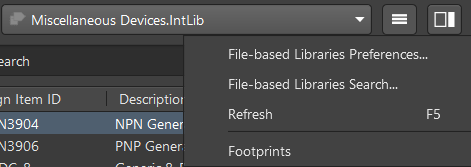

# Lib-ADP

> 常用Altium Designer封装库整理

### 使用方式

使用如下指令将Lib-ADP复制到本地

```shell
git clone git@github.com:redlightASl/Lib-ADP.git
```

随后打开`<Lib-ADP根目录>/Lib-ADP/libadp.LibPkg` ，等待AD读入源文件后，右键工程并选择 `Compile Integrated Library libadp.LibPkg` 指令，等待编译集成库文件。

完成后，可以得到 `<Lib-ADP根目录>/Build/libadp.IntLib` 文件。只需要将其添加到需要AD工程即可使用。

> **添加到Altium Designer库文件的方式**
>
> 1. **将集成库文件添加到所需工程**
>
>     在 `Components` 选项卡上方，选择 `File-based Libraries Preferences` 后，进入 `工程` 子选项卡，选择 `添加库...` ，并将 `<Lib-ADP根目录>/Build/libadp.IntLib` 集成库文件添加到当前工程。随后会发现 `Projects` 选项卡中对应的项目内会出现 Libraries 类文件集，即Lib-ADP被添加到本工程。
>
>     
>
>     同时，完成后即可在 `Components` 选项卡中看到 `libadp.IntLib` 目录。
>
>     > 这是比较推荐的使用方法，因为这样安装的库文件只能在当前工程使用，用户可以将编译出的集成库文件复制到工程下，这样工程的原理图库不会随着LibADP更新而失效。
>
> 2. **全局添加集成库文件**
>
>     在 `Components` 选项卡上方，选择 `File-based Libraries Preferences` 后，进入 `已安装` 子选项卡，选择 `安装...` ，并将 `<Lib-ADP根目录>/Build/libadp.IntLib` 文件选中。
>
>     完成安装后可以在全局所有工程中使用对应版本的Lib-ADP。
>
>     > 集成库是.LibPkg工程的编译结果，不能直接编辑。如需更改集成库，需要先在 `<Lib-ADP根目录>/Lib-ADP/libadp.LibPkg` 工程中进行修改，然后重新编译集成库。
>     >
>     > 集成库也可以被作为库文件的“压缩包”打开，用户也可以将其“解压”后使用得到的.SchLib和.PcbLib文件
>
> 3. **直接添加库文件**
>
>     您可以直接将 `<Lib-ADP根目录>/Lib-ADP` 目录下的 `*.PcbLib` 和 `MySchLib.SchLib` 文件添加到项目来使用本库，这是最易于添加的方法，但用户将不能在 `Components` 选项卡中快捷放置元件，需要手动打开 .SchLib 文件调用元件实例
>
> 4. **添加库目录搜索路径**
>
>     在新版Altium Designer（大于AD23.0.2）中，允许用户使用类似“Include Path”的方式来搜索库文件
>
>     在 `Components` 选项卡上方，选择 `File-based Libraries Preferences` 后，进入 `搜索路径` 子选项卡，选择 `路径...` ，并选择 `<Lib-ADP根目录>/Build/` 目录作为集成库文件的搜索路径
>

### 集成本库

如果新建了一个git项目，可以使用以下指令添加本子模块（submodule）到git项目内

```shell
git submodule add git@github.com:redlightASl/Lib-ADP.git <子模块目录>
```

使用

```shell
git submodule update --remote --force
```

强制更新本地ADP到最新版本

### 贡献

如果您希望对该仓库进行贡献，请联系仓库管理员，本项目仅供实验室内部学习交流使用，不对外开放贡献。

您可以使用[altium-lib-diff](https://github.com/goshdarnharris/altium-lib-diff)来进行跨版本比较以查看本仓库加入了哪些新东西或对旧东西进行了哪些修改。

### 版本更新记录

当前版本：`beta0.6`

* 2022.11.3前-beta0.1
* 2022.11.3-beta0.2
* 2023.7.13-beta0.3
* 2023.8.31-beta0.4
* 2024.3.14-beta0.5-ReleaseV1.0
* 2024.8.9-beta0.6
